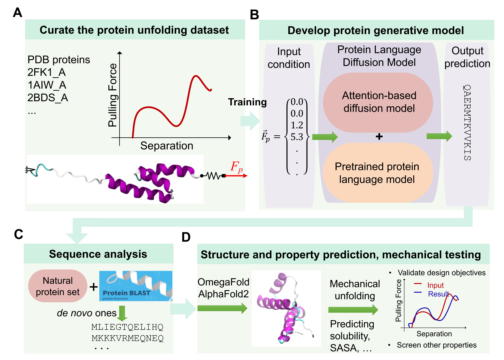

# ProteinMechanicsDiffusionDesign

## End-to-end de novo protein generation based on nonlinear mechanical unfolding responses using a protein language diffusion model

### Summary
Through evolution, nature has presented a set of remarkable protein materials, including elastins, silks, keratins and collagens with superior mechanical performances that play crucial roles in mechanobiology. However, going beyond natural designs to discover proteins that meet specified mechanical properties remains challenging. Here we report a generative model that predicts protein designs to meet complex nonlinear mechanical property-design objectives. Our model leverages deep knowledge on protein sequences from a pre-trained protein language model and maps mechanical unfolding responses to create novel proteins. Via full-atom molecular simulations for direct validation, we demonstrate that the designed proteins are novel, and fulfill the targeted mechanical properties, including unfolding energy and mechanical strength, as well as the detailed unfolding force-separation curves. Our model offers rapid pathways to explore the enormous mechanobiological protein sequence space unconstrained by biological synthesis, using mechanical features as target to enable the discovery of protein materials with superior mechanical properties.

### Installation and use

A colab notebook is included in this repository that feature the trained model.  

[a relative link](./notebook_for_colab/pLDM_inferring_standalong_colab.ipynb)

To install and run, just clike the "open in Colab" badge or the link above and run all.
Note that, the first run may take time due to initial download and installation of packages and models.

